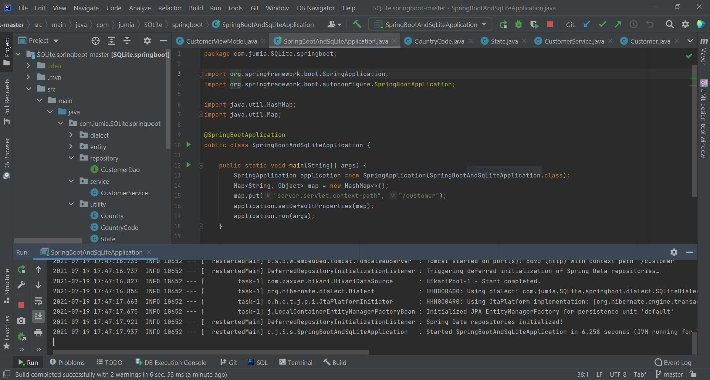

# Customer Springboot Application

* Customer back end application using springboot building RESTful Web Services that we can contact with using API and  front end applications.
* Customer back end plays the whole role starting from loading the database and run filtration on it based state of the phone number and country which is from.

# Connect to the Internet -Back End Part

 It leverages the following components :

* [Spring Framework](https://spring.io/projects/spring-framework)
* [Java util Regex](https://docs.oracle.com/javase/7/docs/api/java/util/regex/package-summary.html)

 
 ## Screenshots

 
## How to boot up this application  
* load the file on Inteliji IDE  or any prefered IDE .

https://github.com/AbdelrhmanSror/springboot-backend/blob/8e78bed0b92a6cd267679e286b7c6d92d10433a5/src/main/java/com/jumia/SQLite/springboot/SpringBootAndSqLiteApplication.java

* run the application

# running docker file

## link of the project on dockerHub.
  https://hub.docker.com/repository/docker/sror12347/customer-sql-springboot .
  
### command to run docker file.
* if you are going to run the docker file map it to port 8090

  docker run -p 8090:8090 sror12347/customer-sql-springboot:v1

# Connect to the Internet -Front End Part

 ## Screenshots

## How to boot up this application  
In the project directory, you can run:
### npm install
then
### `npm run start`

* Runs the app in the development mode.
* Open [http://localhost:3000](http://localhost:3000) to view it in the browser.

* The page will reload if you make edits.
* run the application.

# running docker file

## link of the project on dockerHub.
https://hub.docker.com/repository/docker/sror12347/springboot-frontend
  
### command to run docker file.
* if you are going to run the docker file map it to port 3000

  docker run -p 3000:3000 sror12347/springboot-frontend

### ENJOY

